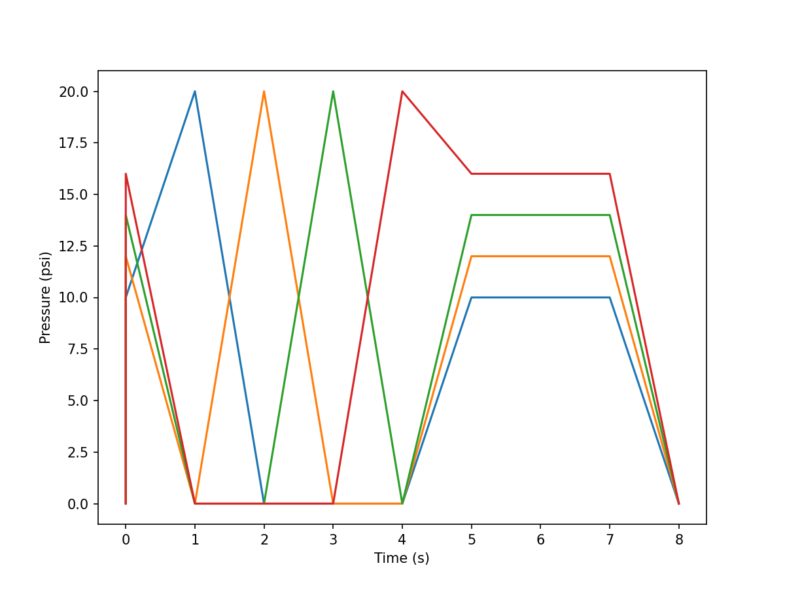
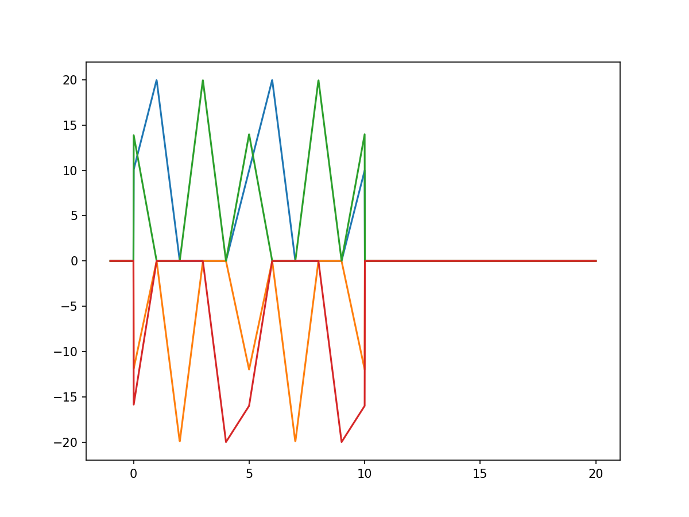

.. _build_one_example:

====================
Build One Trajectory
====================

In this example, we will build one trajectory from a definition file, create an interpolator, and use that interpolator to generate a graph.

Trajectory Definition
---------------------

Trajectories are defined in YAML files as either a series of waypoints, or simple periodic functions. Here we will look at a typical waypoint trajectory:

:fa:`file-code-o,fa-primary` `setpoint_traj_demo.yaml <https://github.com/harvard-microrobotics/sorotraj/blob/main/examples/traj_setup/setpoint_traj_demo.yaml>`_

.. literalinclude:: ../../examples/traj_setup/setpoint_traj_demo.yaml

All trajectories can have three component:

1. ``prefix`` - Runs once at the beginning of the trajectory
2. ``main`` - Can be looped over and over (ensure the first and last waypoint are equal)
3. ``suffix`` - Runs once at the end of the trajectory

Within each trajectory component, each waypoint is defined as a list:

* **arg #0** - Time (in seconds)
* **args #1-N** - Waypoint values for each signal

Trajectory Builder
------------------
We need to build this trajectory before we can use it. To do this, we use a ``TrajBuilder`` object, and give it a file to load the definition from.

.. code-block:: python

    file_to_use = 'traj_setup/setpoint_traj_demo.yaml'
    builder = sorotraj.TrajBuilder() # Make a traj-builder object
    builder.load_traj_def(file_to_use) # Load the file
    traj = builder.get_trajectory()

.. note::

    We can also directly load a trajectory definition py passing a dictionary to the ``TrajBuilder``: ``builder.set_definition(def_dict)``

Now that we have the trajectory (``traj``), let's plot it:

.. code-block:: python

    builder.plot_traj()

Trajectory Interpolator
-----------------------

Now we want to create an interpolator so we can have a convenient way to get trajectory values given arbitrary values of time. We do this with an ``Interpolator`` object. Here, we want to get an interpolator function that loops the ``main`` trajectory component 2 times, with a speed factor of 1.0 (times as defined in the definition), and invert signals 1 and 3 (these are indices).

.. code-block:: python

    interp = sorotraj.Interpolator(traj)

    # Get the actuation function for the specified run parameters
    actuation_fn, final_time = interp.get_traj_function(
                    num_reps=2,
                    speed_factor=1.0,
                    invert_direction=[1,3])

 
Now that we have an interpolation function we can input a time (or vector of times) and obtain the trajectory at arbirary times. This function is useful when performing simulations of soft systems.

In this example, we go from -1 (before the start of the trajectory) to 20 sec. (well beyond the end of the trajectory).

.. code-block:: python

    times = np.linspace(-1,20,2000)
    vals = actuation_fn(times)

    plt.figure(figsize=(8,6),dpi=150)
    plt.plot(times, vals)
    plt.show()

Full Code
---------

Here's the whole example in one file:

:fa:`file-code-o,fa-primary` `build_one_trajectory.py <https://github.com/harvard-microrobotics/sorotraj/blob/main/examples/build_one_trajectory.py>`_

.. literalinclude:: ../../examples/build_one_trajectory.py